# Nomenclator — Solution Overview

Visual reference for the v1 build. Every diagram below is Mermaid; the same diagrams will be reused in the in-app Docs page so the tool is self-documenting.

---

## 1. System context

Who talks to what. A single human ("the operator") uses a browser, which talks to one FastAPI server on Fly.io, which talks to SQLite on the same volume and to Anthropic's Message Batches API. Python is chosen for the backend specifically so we can use `rapidfuzz` for the clustering step (see diagrams 6 and 6b); Node has no equivalent of the same quality.

The FastAPI process runs **two concurrent things** in one Python process: (1) the HTTP request handlers, and (2) a long-running asyncio **background worker** started in the FastAPI lifespan that periodically scans SQLite for non-terminal jobs and polls Anthropic for batch status. One process, one Fly machine, no Celery / Redis / extra moving parts.

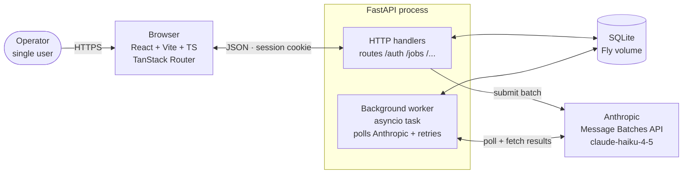

---

## 2. Frontend page map

Three routes, all under one SPA. TanStack Router handles the split. Tool is the only interactive page; About and Docs are content.

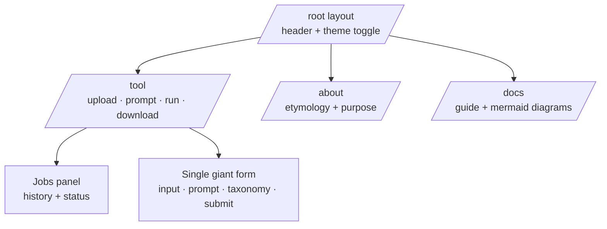

---

## 3. Data model (v1, with v2 seam)

The `task_templates` table is the seam for future generality. In v1 it has exactly one seeded row, `job_titles_es`. Every `job` references a template, so v2 is additive. The `clusters` table is new: it stores the fuzzy-clustering result so row expansion at the end of a job is a deterministic join, and so the operator can audit which titles were treated as the same.

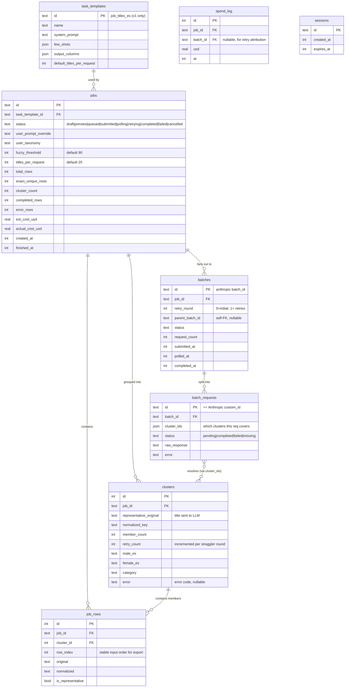

**Key design points:**

- **Standardized outputs** (`male_es`, `female_es`, `category`, `error`) live on `clusters`, not `job_rows`. Every row inherits its answer via `cluster_id`. Export is a pure SQL join, not a loop.
- **`batch_requests`** is the critical mapping table. Anthropic returns results keyed by `custom_id`, one line per request; each request handled `titles_per_request` cluster representatives bundled in a JSON array. Straggler detection = diff the expected `cluster_ids` set against the IDs present in the parsed response.
- **`batches.retry_round`** lets us distinguish the initial batch (round 0) from straggler retries (rounds 1–3). `parent_batch_id` is a self-FK for audit.
- **`job_rows.row_index`** is the stable input order so the CSV export preserves row ordering exactly.

---

## 4. Job lifecycle state machine

Every job walks this path. The server stores state in SQLite so a Fly restart mid-run resumes cleanly — on boot the background worker scans for non-terminal jobs and re-polls their `batch_id`s. The `preview` state is entered when the operator has uploaded rows and run the clustering preview but has not yet committed. Preview work is cheap (no Anthropic calls). The `retrying` state is entered when the initial batch returned with stragglers and a retry round is being submitted.

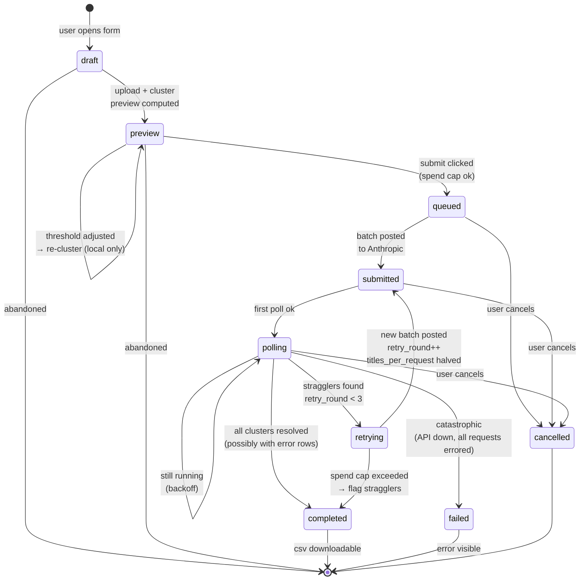

**"Completed" vs "failed" — the important distinction:**

- `completed` = the job ran end-to-end and produced a CSV. `error_rows > 0` is allowed; those rows carry per-row `error` codes but the file is delivered.
- `failed` = the job could not produce any CSV. Reserved for catastrophic, job-level failures: Anthropic outage, all requests schema-failed, server crash mid-write, etc.

This matters because the row-count invariant (diagram 12) only holds for `completed` — failure produces no file, not a partial one.

---

## 5. Happy-path sequence — submit to download (with retries)

End-to-end timeline, including the stragglers retry loop and the split between HTTP handlers and the background worker. The operator can close the tab after submit and come back later; state lives in SQLite, the worker carries on.

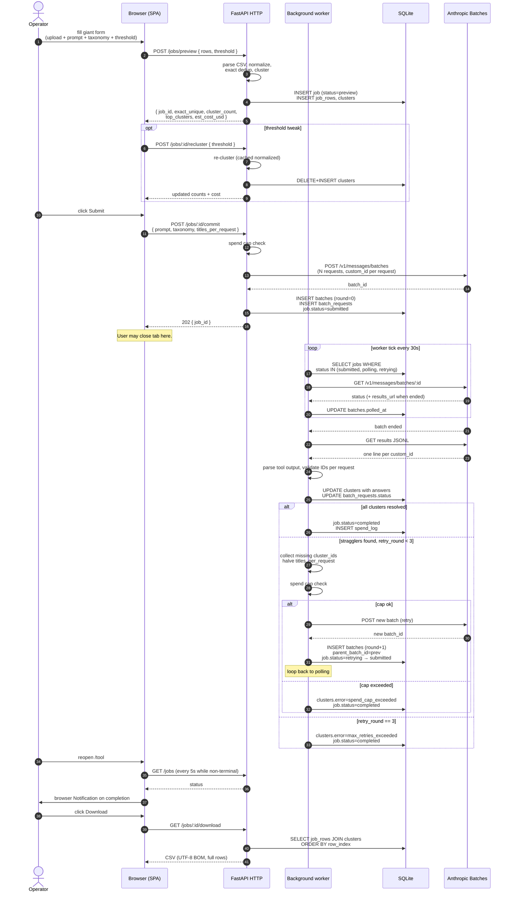

---

## 6. Pipeline: dedup → cluster → batch → propagate

The consistency and cost-saving layer. 16k raw titles collapse to ~8k after exact dedup, then to ~2–4k after fuzzy clustering. **Only cluster representatives** go to the model; every other row inherits its answer via its cluster. This guarantees "Jefe Compras" and "Jefe de Compras" receive the *same* standardized output, which is the whole point of the tool. Without this step, the LLM would see similar titles in different batches with different few-shot neighbors and produce divergent answers — a silent failure mode that would only surface weeks later.

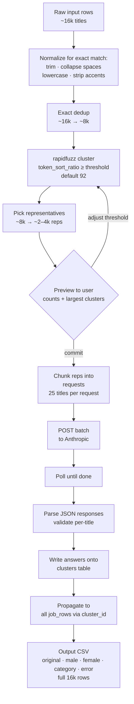

---

## 6b. Clustering algorithm internals

The risky step. Misclustering is silent corruption: if "Product Manager" and "Project Manager" fall into the same cluster, one representative propagates the wrong answer to every member. We mitigate with the right similarity metric, a conservative default threshold, a hard length-ratio guard, union-find for connected components, and a mandatory human preview before commit.

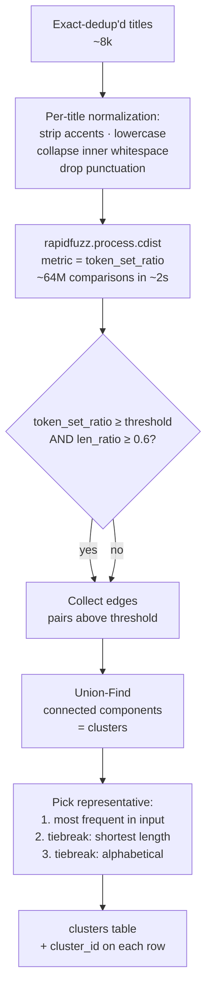

**Why `token_set_ratio` as the primary metric (not `token_sort_ratio`):**

The dominant variation in real Spanish job titles is dropped/added stop words: `"Jefe Compras"` vs `"Jefe de Compras"`, `"Director Ventas"` vs `"Director de Ventas"`. `token_set_ratio` treats these as near-identical (typically 95–100) because it compares the set of tokens after handling common-vs-different words asymmetrically. `token_sort_ratio` is stricter and may score the same pair at ~80, pushing it below a 90 threshold and failing to merge.

**Why the length-ratio guard is mandatory:**

`token_set_ratio` alone has a failure mode: `"Jefe"` and `"Jefe de Compras Internacionales del Grupo"` both contain the token `"jefe"`, so the shorter-vs-longer set comparison can return a high score. A length-ratio gate (`min(len_a, len_b) / max(len_a, len_b) ≥ 0.6`) blocks these merges before they can happen. 0.6 is conservative; tunable per job.

**Connected components:** hand-rolled union-find (~20 lines, path compression + union by rank), not `networkx` — avoids a heavy dep and is faster for our sizes.

**Representative selection is fully deterministic:** same input → same representative, every time. Stability matters because the cluster preview the operator approves must be the same cluster structure that runs.

**Guardrails baked into v1:**
- Default threshold **90** on `token_set_ratio`; configurable per job (50–100).
- Hard gate: `len_ratio ≥ 0.6` always applied regardless of threshold.
- Preview endpoint returns the **top 10 largest clusters** with all members, so the operator can eyeball homogeneity before committing Anthropic spend.
- Full cluster mapping persisted in the `clusters` table for post-hoc audit.
- Clusters larger than 50 members trigger a "large cluster" warning in the preview UI.
- Expected latency: ~2–3 seconds for 8k uniques on a shared Fly machine. Acceptable for an interactive preview.

---

## 7. Spend cap enforcement

Hard $20/month ceiling. The estimate is computed **after clustering** (reflects actual representative count, not raw rows) and checked on the `/commit` call, before any Anthropic request. Rolling 30-day window. **Retry batches are also subject to the cap** — the background worker runs the same check before submitting a straggler retry, and flags remaining stragglers with `error=spend_cap_exceeded` if the cap would be busted.

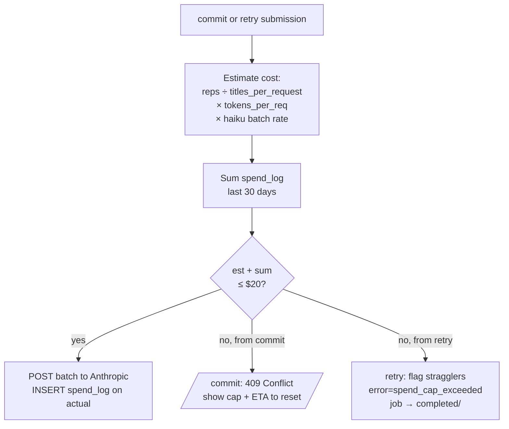

---

## 8. Auth flow

Single shared password. Server stores an argon2 hash as a Fly secret. A successful login sets an httpOnly session cookie backed by the `sessions` table. All `/jobs` routes require the cookie.

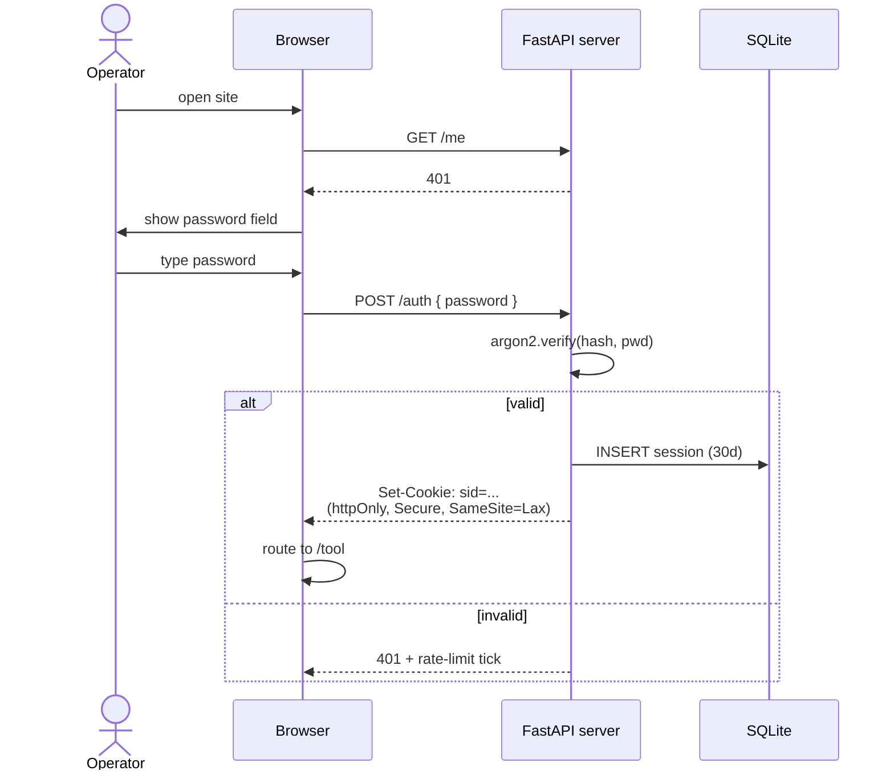

---

## 9. Scope trajectory — v1 → v2 → v3

The engine is generic from day one. The UX is not. v1 ships with one `task_template`; each later version adds templates (and, eventually, a blank-slate mode) without rewriting the runner.

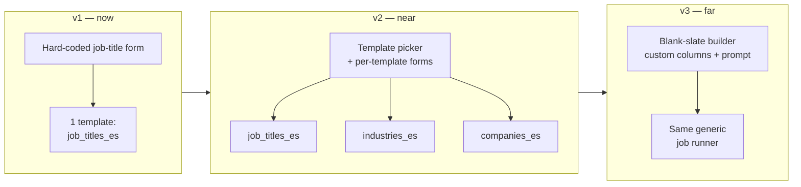

---

## 10. Deployment topology on Fly.io

One app, one region initially, one persistent volume for SQLite + uploaded CSVs. Anthropic key lives in Fly secrets, never ships to the browser. The frontend is built into static assets and served by the same FastAPI process (or by Fly's static file serving); no separate CDN for v1.

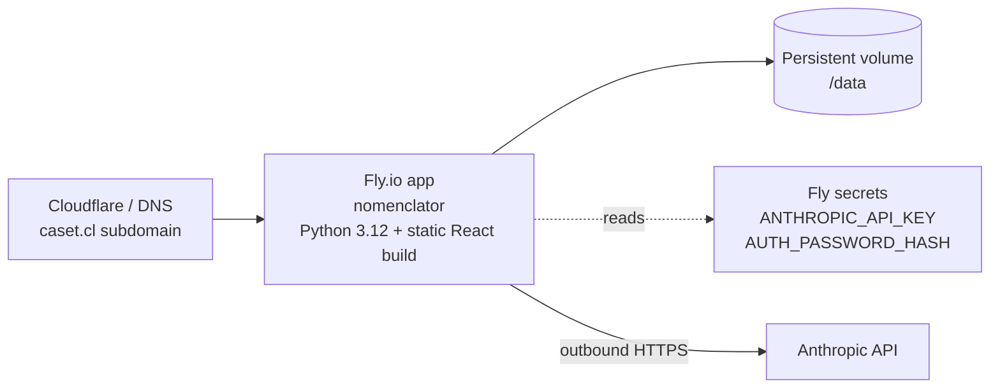

---

## 11. Cost model (why clustering matters more than batching)

Rough math for a 13,600-row run, showing why the consistency motivation dominates the cost motivation. Haiku 4.5 batch rates ≈ 50% off Haiku standard (~$0.80/MTok input, ~$4/MTok output — *ballpark*, confirm at build time).

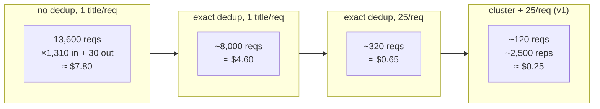

All four options fit inside the $20/mo cap comfortably. **The reason v1 uses clustering is not cost — it's that "Jefe Compras" and "Jefe de Compras" must produce the same Spanish output, and only clustering guarantees that.**

---

## 12. Reliability: guaranteeing N input rows → N output rows

The hardest problem in any LLM-CSV pipeline: "I sent 100 rows, I got 87 back." Defense-in-depth across seven layers, from preventing the failure to catching it if it happens anyway. The hard contract at the bottom: **the output CSV has exactly the same number of rows as the input, in the same order, and no row is ever silently dropped.**

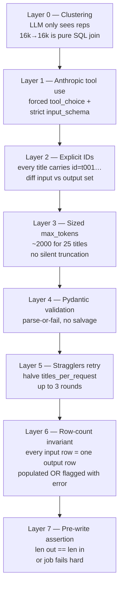

### The stragglers retry sub-flow

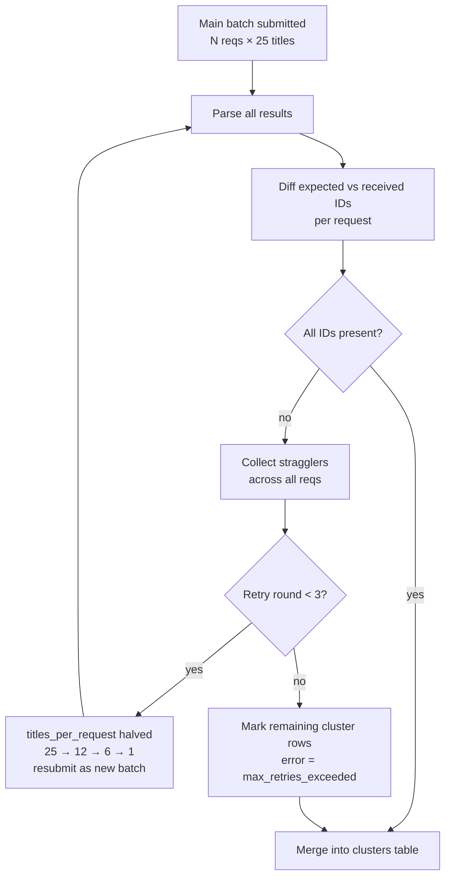

### The contract, written plainly

> Every row in the uploaded CSV corresponds to exactly one row in the downloaded CSV, in the same order.
> Every output row is in one of two states:
>
> - **Populated** — `male_es`, `female_es`, `category` filled, `error` empty.
> - **Flagged** — `error` contains a specific failure reason; the answer columns may be empty or best-effort.
>
> No row is ever silently dropped. No row is ever duplicated. Order is preserved.

This is enforceable because input rows get a stable `row_id` on ingestion, every row lands in a cluster (of size ≥1), every cluster is either resolved or flagged, and export is `SELECT … FROM job_rows JOIN clusters ORDER BY row_id` — a pure join. The pre-write assertion is the last line of defense: if `len(out) != len(in)` for any reason, the job transitions to `failed` and the operator gets an error, never a partial CSV.

---

## 13. The two batching knobs

Two separate things called "batch size," both adjustable, both meaningful:

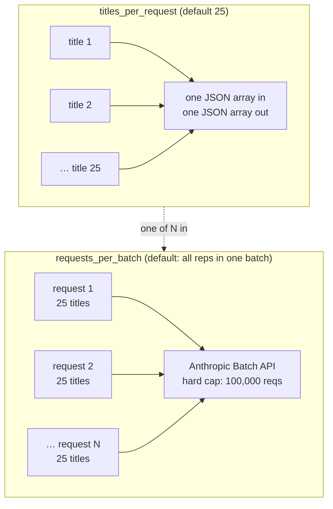

**`titles_per_request` tradeoffs:**

| Setting | Cost | JSON reliability | Retry granularity |
|---|---|---|---|
| 1 | highest (no prompt amortization) | best | best |
| 10 | medium | good | good |
| **25 (default)** | low | good | acceptable |
| 50 | lowest | risky (truncation) | poor (one bad title kills many) |

**`requests_per_batch`** rarely needs tuning — Anthropic's batch endpoint happily accepts all the representatives for one job in a single submission. The only reason to split is if a job has > 100,000 reps, which won't happen at v1 scale.

Both knobs live in the Advanced disclosure of the giant form; defaults are invisible.

---

_All thirteen diagrams are authoritative for the spec build. Any change here must propagate into `spec/` and `plan/`._
